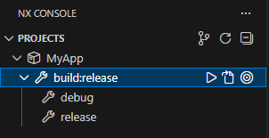

# Issue Reproduction Repository

Disabling `@nx/dotnet` target named `build:release` doesn't work.

For example let's disable all targets:

```json
{
  "plugin": "@nx/dotnet",
  "options": {
    "build": false,
    "build:release": false,
    "publish": false,
    "pack": false,
    "watch": false,
    "run": false,
    "restore": false,
    "clean": false
  }
}
```

and look at how `nx` sees it:

```shell
> npx nx show project MyApp --json
{"root":"MyApp","name":"MyApp","metadata":{"technologies":["dotnet","C#"]},"targets":{"build:release":{"options":{"cwd":"MyApp","args":["--no-restore","--no-dependencies","--configuration","Release"],"command":"dotnet build"},"configurations":{"debug":{"args":["--no-restore","--no-dependencies","--configuration","Debug"]},"release":{"args":["--no-restore","--no-dependencies","--configuration","Release"]}},"dependsOn":["^build:release"],"cache":true,"inputs":["production","^production"],"outputs":["{projectRoot}/bin","{projectRoot}/obj"],"metadata":{"description":"Build the .NET project in Release configuration","technologies":["dotnet","C#"]},"executor":"nx:run-commands","parallelism":true}},"implicitDependencies":[],"tags":[]}
```

`"build:release"` is still present while being disabled.


